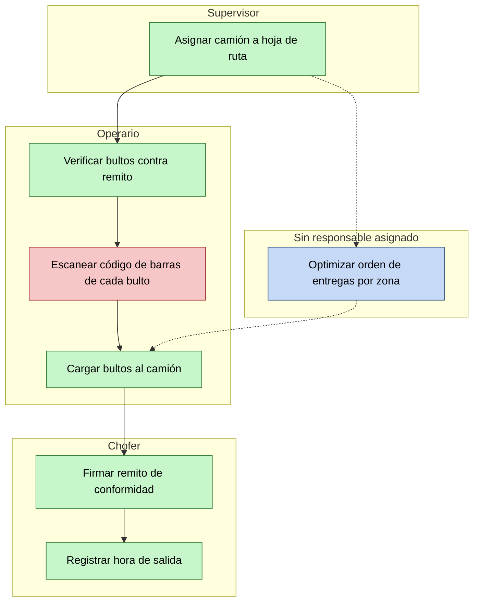

# Ejemplo de diagrama por capas (datos genéricos de logística)

Este ejemplo usa datos ficticios solo para mostrar la técnica. Reemplazalo
por tus procesos reales una vez que tengas la planilla de inventario
completa.

## 1. Mapa macro de procesos (nivel Proceso)

Un solo diagrama, cajas grandes, sin detalle interno.

## 2. Diagrama de un procedimiento, con carriles por persona

Ejemplo del procedimiento "Carga de camión" (dentro del proceso
Distribución de Mercadería). Colores: 🟩 se hace / 🟥 debería hacerse
(falta) / 🟦 mejora futura.

### Lectura de este diagrama (lo que le mostrás a tu jefe/gerencia)

- El carril **Operario** tiene 3 tareas, una de ellas (🟥 escanear código
  de barras) no se hace hoy por falta de tiempo — y es la causa de
  diferencias de stock, un problema que sí se nota "río abajo".
- La caja 🟦 (optimizar rutas) no tiene carril propio porque **no hay
  nadie asignado** — ese es literalmente el hueco de un puesto nuevo
  (ej: un planificador de rutas o un rol de mejora continua).
- Con la planilla de inventario, esas dos cajas (🟥 y 🟦) tienen una
  cantidad de horas-persona/mes calculada, que es el número que sostiene
  el pedido de personal.

## Cómo replicarlo con tus datos

1. Completá `plantilla-inventario-tareas.csv` con tus procesos reales
   (aunque sea incompleto al principio, no importa — se va sumando).
2. Agrupá las filas por Proceso → armá el mapa macro (paso 1).
3. Agrupá por Procedimiento → armá un diagrama como el del paso 2 por
   cada uno, con un carril por persona/rol real de tu equipo.
4. Pintá cada caja según la columna "Estado" de la planilla.
