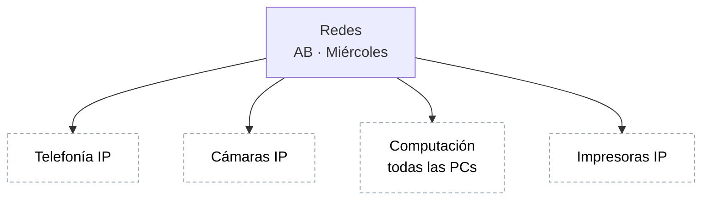

# Nivel 2 — Redes (AB, miércoles)

Procedimientos confirmados directamente por JL (12/08/2026) — no son una
inferencia a partir de datos previos, como sí lo fue Stock. Ninguno tiene
tareas cargadas todavía.

## Preguntas abiertas antes de cargar tareas

1. ¿Estos 4 procedimientos son todos, o falta alguno más dentro de Redes?
2. **Red NCS** (la sede de Nuevocentro Shopping) — habíamos hablado de
   ella antes como parte de Redes: ¿es un 5º procedimiento propio, o son
   tareas de estos mismos 4 procedimientos que simplemente ocurren en esa
   sede (y se marcarían con la sede como un dato de la tarea, no como un
   procedimiento aparte)?

## Próximo paso

Elegir uno de los 4 procedimientos y empezar a cargar sus tareas reales
(qué se hace, con qué objetivo, y — más adelante — cuánto tiempo lleva).
