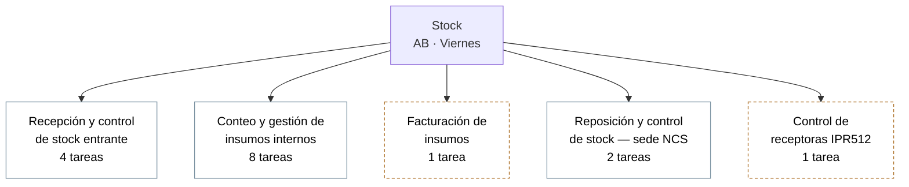

# Nivel 2 — Stock (AB, viernes)

Propuesta de 5 procedimientos a partir de las 16 tareas ya relevadas en
`plantilla-inventario-tareas.csv`. **Es un borrador a confirmar**, no un
dato cerrado — a diferencia de Redes, acá sí agrupé tareas existentes por
mi cuenta y falta que JL lo valide.

## Detalle por procedimiento

**Recepción y control de stock entrante** (4 tareas): Conteo de stock
recibido · Control de stock recibido · Sellado y etiquetado · Almacenamiento.

**Conteo y gestión de insumos internos** (8 tareas): Conteo/solicitud de
limpieza, cocina, librería y botiquín.

**Facturación de insumos** (1 tarea): Cargar facturas de insumos. — *¿se
fusiona con "Conteo y gestión de insumos internos"?*

**Reposición y control de stock — sede NCS** (2 tareas): Reposición de
Stock NCS · Control stock NCS y conteo (Ezviz/Easy).

**Control de receptoras IPR512** (1 tarea): Control de buen estado (R-04).
— *¿se fusiona con algún otro procedimiento, o se mantiene separado
porque es un tipo de control distinto (equipos, no stock/insumos)?*

## Próximo paso

Confirmar si los dos procedimientos de 1 sola tarea quedan como están o
se fusionan, y completar objetivo + tiempo real de cada tarea.
