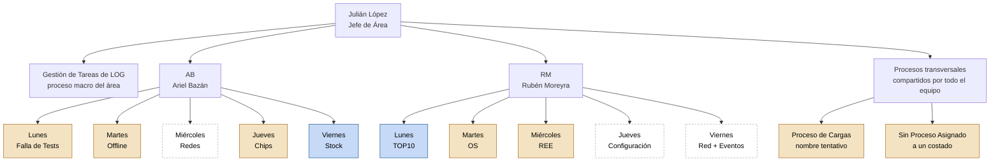

# Organigrama de nivel 1 — Área LOG

Primer nivel del diagrama de flujo del área: Julián López conduce el
proceso macro de **Gestión de Tareas de LOG**, delegado en AB y RM, cada
uno a cargo de 5 bloques diarios (sus "macrotareas"). Este es el punto de
partida para seguir abriendo cada bloque en Procedimientos y Tareas.

Versión visual (con estado de relevamiento por bloque, coloreado):
ver el artifact publicado, o el diagrama Mermaid equivalente abajo.

**Cambios del 18/08/2026:** el jueves de AB **es Chips**, confirmado por
JL — contiene el bloqueo/desbloqueo de equipos AXpro y Paradox (yo lo
había renombrado a "Ingreso Remoto a Clientes" por error de
interpretación, ya corregido). Queda pendiente confirmar si este Chips
de AB se fusiona con "Gestión de Chips (administrativo)" de RM como dos
procedimientos de un mismo proceso (AB = bloqueo/desbloqueo operativo,
RM = facturación/altas-bajas administrativo), ya que ambos caen los
jueves. Además aparecieron dos procesos que no son de un día ni de una
persona: **Proceso de Cargas** (mantener la hoja de Procesos Diarios) y
**Sin Proceso Asignado** (tareas compartidas — publicidad en WhatsApp,
ordenar escritorio — que todavía no tienen un proceso propio). Ver el
árbol completo de AB en `arbol-completo-ab.md`.

## Estado de relevamiento por bloque (12/08/2026)

| Persona | Día | Bloque | Estado | Detalle |
|---|---|---|---|---|
| AB | Lunes | Falla de Tests | Parcial | 3 tareas relevadas |
| AB | Martes | Offline | Parcial | 2 tareas relevadas |
| AB | Miércoles | Redes | **Sin tareas** | 4 procedimientos confirmados por JL: Telefonía IP, Cámaras IP, Computación, Impresoras IP — ver `nivel2-redes-ab.md` |
| AB | Jueves | Chips | Parcial | 4 tareas (bloqueo/desbloqueo AXpro y Paradox); a confirmar si se fusiona con "Gestión de Chips (administrativo)" de RM |
| AB | Viernes | Stock | Documentado | 8 procedimientos, ~30 tareas (ver `arbol-completo-ab.md`) |
| RM | Lunes | TOP10 | Documentado | 11 pasos relevados (instructivo completo) |
| RM | Martes | ODS (Órdenes de Servicio) | Parcial | 6 tareas relevadas |
| RM | Miércoles | REE (Remoto de Equipos) | Parcial | 6 tareas relevadas |
| RM | Jueves | Configuración AXPRO | **Parcial (nombre a reconciliar)** | Nombre confirmado por JL (18/08/2026); las 12 tareas cargadas hoy son de facturación de chips, no de "configurar AXPRO" — falta confirmar si es lo mismo |
| RM | Viernes | Revisión de Eventos Diarios / Red | **Sin datos** | 0 tareas relevadas |

Ninguno de estos números incluye tiempos ni objetivos confirmados — eso
es la siguiente capa a completar dentro de cada bloque (ver
`resumen-carga-horaria.md` y `plantilla-inventario-tareas.csv`).

## Próximo paso

Elegir uno de los 10 bloques y abrirlo en el siguiente nivel del
diagrama (sus Procedimientos y Tareas, con descripción, objetivo y
tiempo real). Prioridad sugerida: los 3 bloques "Sin datos" — Redes
(AB, miércoles), Configuración y Red + Eventos (RM, jueves y viernes).
