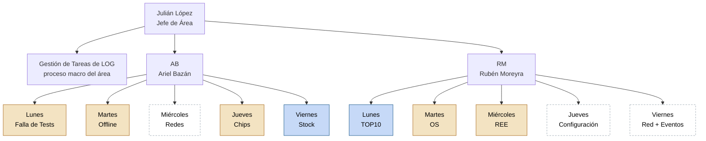

# Organigrama de nivel 1 — Área LOG

Primer nivel del diagrama de flujo del área: Julián López conduce el
proceso macro de **Gestión de Tareas de LOG**, delegado en AB y RM, cada
uno a cargo de 5 bloques diarios (sus "macrotareas"). Este es el punto de
partida para seguir abriendo cada bloque en Procedimientos y Tareas.

Versión visual (con estado de relevamiento por bloque, coloreado):
ver el artifact publicado, o el diagrama Mermaid equivalente abajo.

## Estado de relevamiento por bloque (12/08/2026)

| Persona | Día | Bloque | Estado | Detalle |
|---|---|---|---|---|
| AB | Lunes | Falla de Tests | Parcial | 3 tareas relevadas |
| AB | Martes | Offline | Parcial | 2 tareas relevadas |
| AB | Miércoles | Redes | **Sin datos** | 5 procedimientos identificados (ISP, Telefonía IP, Red NCS, Cámaras, Impresoras), 0 tareas con detalle |
| AB | Jueves | Chips | Parcial | 4 tareas relevadas (aparecen como "Bloqueo/Desbloqueo de equipos" en el catálogo — confirmar si es lo mismo que "Chips") |
| AB | Viernes | Stock | Documentado | 16 tareas relevadas |
| RM | Lunes | TOP10 | Documentado | 11 pasos relevados (instructivo completo) |
| RM | Martes | OS (Órdenes de Servicio) | Parcial | 6 tareas relevadas |
| RM | Miércoles | REE (Remoto de Equipos) | Parcial | 6 tareas relevadas |
| RM | Jueves | Configuración | **Sin datos** | No aparece con ese nombre en el catálogo; candidatos a confirmar: Gestión de Chips (administrativo), Directivas técnicas |
| RM | Viernes | Red + Revisión de Eventos | **Sin datos** | 0 tareas relevadas |

Ninguno de estos números incluye tiempos ni objetivos confirmados — eso
es la siguiente capa a completar dentro de cada bloque (ver
`resumen-carga-horaria.md` y `plantilla-inventario-tareas.csv`).

## Próximo paso

Elegir uno de los 10 bloques y abrirlo en el siguiente nivel del
diagrama (sus Procedimientos y Tareas, con descripción, objetivo y
tiempo real). Prioridad sugerida: los 3 bloques "Sin datos" — Redes
(AB, miércoles), Configuración y Red + Eventos (RM, jueves y viernes).
